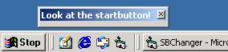



## Start Button Changer

### Description

This program shows you how to set the startbutton picture. It first uses the findwindow api to find the taskbar, then it does a findwindowex api to find the startbutton. From there it gets the device context. Then we can just pain to it.
 
### More Info
 
Windows updates the start button on regular times (about every second). Keep the timer short to prevent flickering

             |
---                |---
**Submitted On**   |2001-04-27 11:29:14
**By**             |[Networking\.be](https://github.com/Planet-Source-Code/PSCIndex/blob/master/ByAuthor/networking-be.md)
**Level**          |Advanced
**User Rating**    |5.0 (20 globes from 4 users)
**Compatibility**  |VB 5\.0, VB 6\.0
**Category**       |[Windows API Call/ Explanation](https://github.com/Planet-Source-Code/PSCIndex/blob/master/ByCategory/windows-api-call-explanation__1-39.md)
**World**          |[Visual Basic](https://github.com/Planet-Source-Code/PSCIndex/blob/master/ByWorld/visual-basic.md)
**Archive File**   |[Start Butt188754272001\.zip](https://github.com/Planet-Source-Code/networking-be-start-button-changer__1-22739/archive/master.zip)

